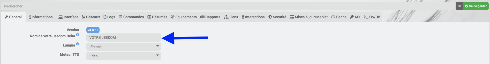

# Freebox_OS-Plugin

## Fehlerbehebung

- **Ich erhalte die Autorisierungsmeldung, die auf der Freebox angezeigt wird, nicht**

  > Überprüfen Sie in den Einstellungen des Freebox-Betriebssystems, ob die Option **Neue Verbindungsanfragen zulassen** aktiviert ist _(Freebox-Einstellungen -> Zugriffsverwaltung -> Registerkarte „Einstellungen“)_
  >
  > 

- **Der Akkustand wird beim Präsenzsensor der Freebox und/oder bei der Fernbedienung nicht angezeigt**

  > Diese Daten werden nicht an die Freebox weitergeleitet, daher ist es nicht möglich, sie in Jeedom abzurufen.
  >
  > Sie sind daher nicht auf der Gesundheitsseite verfügbar (es wird „Sektor“ oder „N/A“ angezeigt).

- **Ich kann die Sirene des Freebox-Alarms nicht steuern**

  > Diese Sirene kann nicht direkt bestellt werden
  > [Siehe Freebox-Bugtracker FS#30650](https://dev.Freebox.fr/bugs/task/30650)

- **Ich erhalte die Meldung „Unbekannte API-Version“**

  > **Damit das Plugin funktioniert, ist mindestens die Freebox-Version 4.7 erforderlich**

  > - Einmal pro Woche wird eine automatische Erkennung der API-Version der Freebox durchgeführt.
  > - Man kann es direkt über den Pairing-Bildschirm starten.
  > - Derzeit ist es erforderlich, den API-Schlüssel bei jedem Update zurückzusetzen.
  >
  > 

  >
  > 

- **Ich erhalte die Meldung „Unbekannter Host, IP-Adresse oder maFreebox.Freebox.fr verwenden“ und der Daemon funktioniert nicht**

  - Nach dem Update der Freebox auf Version 4.2.3
  > Free hat die Adresse der Freebox **_maFreebox.free.fr_** geändert; diese funktioniert nicht mehr und muss durch **_maFreebox.Freebox.fr_** ersetzt werden.
  >
  > Siehe Abschnitt **Installation und Konfiguration**

- **Das Widget für verbundene Geräte ist nicht mehr verfügbar**

  > Das Widget wurde bei einem Update umbenannt.
  >
  > Man muss nach **zusätzlichen Geräten** suchen, um das neue Widget zu erhalten.

- **Beim Pairing erscheinen folgende Meldungen: „Missing device_name“ oder „Ihr Jeedom hat keinen Namen, daher kann der Vorgang nicht fortgesetzt werden“**

  > **Ihr Jeedom hat keinen Namen**
  >
  > Es ist unbedingt erforderlich, dass Ihr Jeedom einen Namen hat, damit die Kopplung des Plugins mit Ihrer Freebox fortgesetzt werden kann.
  >
  > Gehen Sie zu „Einstellungen“ -> „System“ -> „Konfiguration“ -> Registerkarte „Allgemein“ und geben Sie einen Namen ein
  >
  > Führen Sie anschließend die Authentifizierung erneut durch und vergessen Sie dabei nicht, die Konfiguration zurückzusetzen
  >
  > 

  >
  > 

- **CronDaily-Fehler bei Gerätenamen mit Symbolen**

  > - Gerätenamen dürfen keine Symbole enthalten.

- **Die neuen „vernetzten Geräte“ und „vernetzten Geräte im Gast-WLAN“ werden bei der Aktualisierung der Geräte nicht angezeigt**

  > - Neue Geräte werden nicht bei der Aktualisierung hinzugefügt, sondern ausschließlich über den täglichen Cron-Job.

- **Im Debug-Modus gibt es keine Meldungen in den Protokollen**

  > - Was den Tile-Teil betrifft: Da die Aktualisierung mehrmals pro Minute erfolgt, soll verhindert werden, dass die Protokolle überfüllt werden. In den Protokollen erscheint keine Meldung.
  >
  > Um Protokolle anzuzeigen, klicken Sie bei einem Gerät auf die Schaltfläche „Aktualisieren“ des Geräts.

- **Ich erhalte die Meldung „METHODE VERALTET => BITTE SIEHE DOKUMENTATION“**

  > Die Befehle im Bereich „Netzwerk“ haben sich geändert, daher muss die Vorgehensweise angepasst werden, um die folgenden Befehle zu verwenden. *Siehe Abschnitt „Netzwerkverwaltung“*
  >
  > Die folgenden Befehle werden beim nächsten Update entfernt:
  >
  > - **„Hinzufügen – Mac-Filterung entfernen“** für *WLAN*-Geräte
  > - **„Feste IP-Adresse hinzufügen/löschen“** für die Geräte *Verbundene Geräte* und *Verbundene Geräte (Gast-WLAN)*
  > - **„Wake on LAN“** für *vernetzte Geräte* und *vernetzte Geräte im Gast-WLAN*

- **Was bedeuten die verschiedenen Aufgabenmotoren?**

  > - **RefreshToken**: Ermöglicht die Aktualisierung des Zugriffs auf die Freebox
  >
  > - **FreeboxPUT**: Ermöglicht die Ausführung von Aktionen auf der Freebox
  >
  > - **FreeboxAPI**:
    > Ermöglicht das Testen und Überprüfen der neuesten Version der Freebox-API
    > Einmal pro Woche wird eine Kontrolle durchgeführt
  >
  > - **FreeboxGET**: Ermöglicht das Abrufen von Informationsdaten aus dem Bereich der Hausautomation

- **Der Status des Players wird nicht gemeldet**

  > Es muss überprüft werden, ob der Typ für den Befehl „Status“ der Untertyp **Sonstiges** ist.
  > 

  
- **Der Status des Players ist nicht verfügbar**

  > Es ist unbedingt erforderlich, einen Scan der Standardgeräte durchzuführen, während der Player eingeschaltet ist.

- **Die Befehle „Ausgewähltes verbundenes Gerät“ und „Verbundenes Gerät auswählen“ im Menü „Netzwerkverwaltung“**

  > Diese Befehle werden automatisch von den Geräten unter *Verbundene Geräte* und/oder *Über das Gast-WLAN verbundene Geräte* erstellt.

- **Der Daemon kann nicht gestartet werden**

  > Der Daemon darf nur gestartet werden, wenn die Authentifizierung und die Berechtigungen in Ordnung sind. Dies erfolgt über das Menü „Kopplung“.

- **Im Changelog heißt es: Achtung: Damit das Plugin funktioniert, muss die Freebox-Server-Version x.x.x installiert sein.**

 > Damit das Plugin funktioniert, ist eine bestimmte Mindestversion der Firmware erforderlich.
 > 

 > Die erforderliche Firmware-Version ist im Changelog am Anfang sowie am Anfang dieser Dokumentation angegeben.
