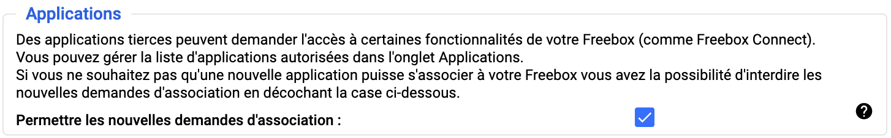
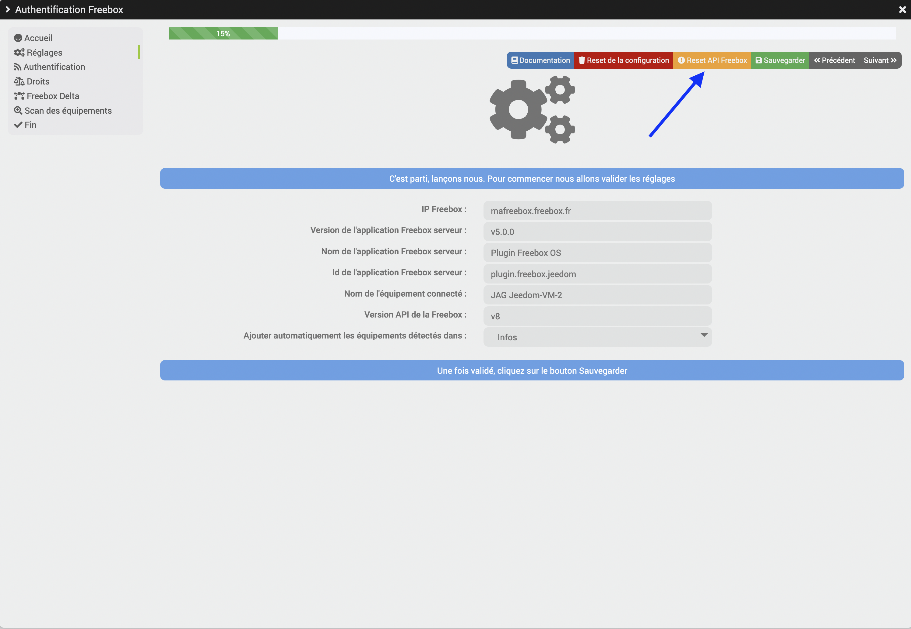
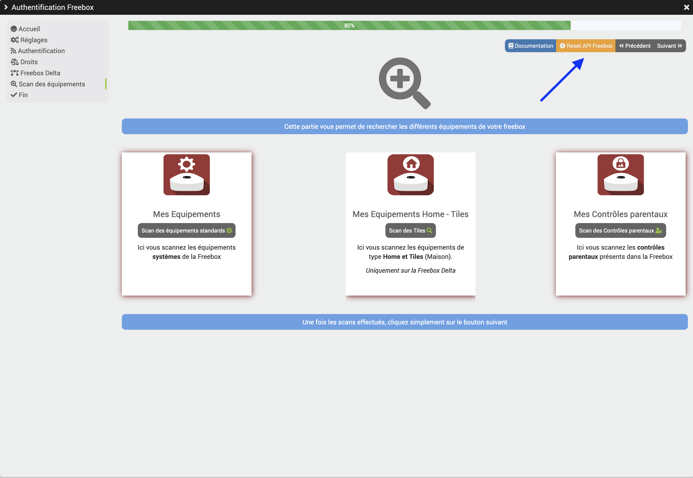
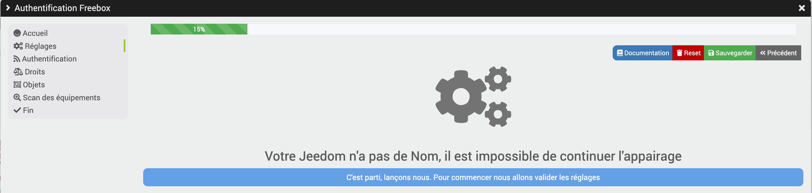
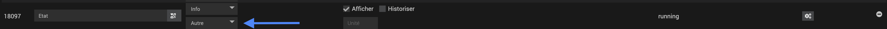
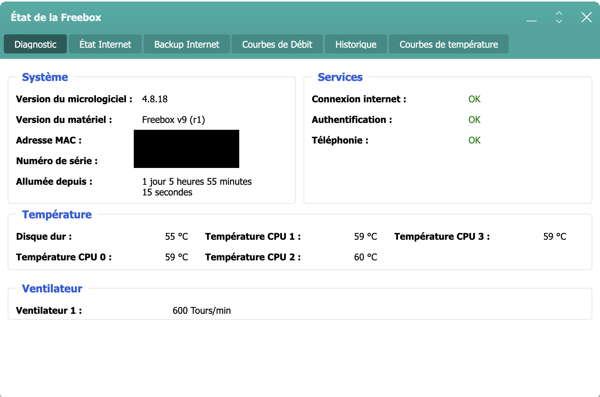

# Freebox_OS plugin

## Troubleshooting

- **I'm not seeing the authorization message that appears on the Freebox**

  > Check the Freebox OS settings to ensure that the **Allow new pairing requests** option is checked _(Freebox Settings -> Access Management -> Settings tab)_
  >
  > 

- **I can't see the battery level on the Freebox motion sensor and/or the remote control**

  > This information isn't being sent to the Freebox, so it's impossible to access it in Jeedom.
  >
  > Therefore, they are not available on the health page (it says "sector" or "N/A")

- **I can't issue commands for the Freebox alarm siren**

  > It is not possible to command this siren directly
  > [See Freebox FS Bug Tracker #30650](https://dev.Freebox.fr/bugs/task/30650)

- **I'm getting the message "Unknown API version"**

  > **You must have Freebox version 4.7 or higher for the plugin to work**

  > - An automatic check for the Freebox API version is run once a week.
  > - You can launch it directly from the Pairing screen
  > - It is currently mandatory to reset the API key with every update
  >
  > 

  >
  > 

- **I'm getting the message "unknown host, use IP address or maFreebox.Freebox.fr" and Demon NOK**

  - Following the Freebox 4.2.3 update
  > Free has changed the Freebox address **_maFreebox.free.fr_**; it no longer works, so you must replace it with **_maFreebox.Freebox.fr_**
  >
  > See the **Installation and Configuration** section

- **I have the connected devices widget, which is no longer available**

  > "The widget was renamed during an update."
  >
  > You need to **search for additional devices** to get the new widget

- **I'm getting the following messages: "Missing device_name" or "Your Jeedom has no name; it is impossible to continue" during pairing**

  > **Your Jeedom has no name**
  >
  > It is essential that your Jeedom be named in order to continue pairing the plugin with your Freebox
  >
  > Go to Settings -> System -> Configuration -> General tab and enter a name
  >
  > Then repeat the authentication process, making sure to reset the configuration
  >
  > 

  >
  > 

- **CronDaily error with device names containing icons**

  > - Device names should not include icons.

- **The new "Connected Devices" and "Guest Wi-Fi Connected Devices" do not appear when the equipment is updated**

  > - New devices are not added during the update but only via the daily cron job

- **I don't see any messages in the debug mode logs**

  > - For the Tile component, since the refresh occurs several times per minute, this is to prevent the logs from filling up. No messages appear in the logs.
  >
  > To view logs for a device, click the "Refresh" button for that device.

- **I'm getting the message "METHOD OBSOLETE" => PLEASE CHECK THE DOCUMENTATION**

  > The commands in the network section have changed, so you’ll need to adjust the method to use the commands below. *See the "Network Management" section*
  >
  > The following commands will be removed in the next update:
  >
  > - **"Add - Remove MAC filtering"** for *Wi-Fi* devices
  > - **"Add/Remove Static IP"** for *Connected Devices* and *Guest Wi-Fi Connected Devices*
  > - **"Wake on LAN"** for *Connected Devices* and *Guest Wi-Fi Connected Devices*

- **What do the different task engines correspond to?**

  > - **RefreshToken**: Allows you to refresh access to the Freebox
  >
  > - **FreeboxPUT**: Allows you to perform actions on the Freebox
  >
  > - **FreeboxAPI**:
    > Allows you to test and verify the latest version of the Freebox API
    > A check is performed once a week
  >
  > - **FreeboxGET**: Retrieves data of the informational type from the home automation section

- **The Player's status is not being reported**

  > You must verify that the type for the "Status" command is the **Other** subtype
  > 

  
- **Player status is not available**

  > You must run a scan of the standard devices while the Player is powered on

- **The "Selected Connected Device" and "Select Connected Device" commands in the Network Management section**

  > These commands will be created automatically by the *Connected Devices* and/or *Guest Wi-Fi Connected Devices*

- **Unable to start the daemon**

  > The daemon will be allowed to start only if authentication and permissions are OK. This is done from the "pairing" menu.

- **The changelog states: Note: You must have Freebox Server version x.x.x for the plugin to work.**

 > The plugin requires a minimum firmware version to function.
 > 

 > The minimum firmware version is listed in the changelog at the beginning and at the start of this documentation
