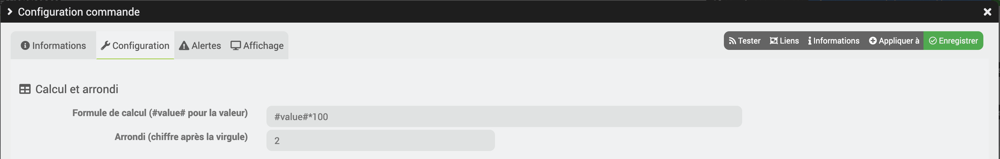

# Complemento Freebox_OS


## Información sobre el historial de cambios

### Importante

> **_Recordatorio_**: si no hay información sobre la actualización, es porque esta se refiere únicamente a la actualización de la documentación, a traducciones o a correcciones de errores menores.
>
> **Atención: Es necesario disponer de la Freebox Server en la versión 4.8.18 para que el complemento funcione.**

### Noticias

> [Ver el hilo de noticias del complemento en la comunidad](https://community.jeedom.com/t/info-plugin-Freebox-mise-a-jour-des-composants-de-la-delta-tiles-systeme/30673)

## 2026

### 30/08/2026

- Traslado de la documentación beta y la traducción
- Corrección de un error en PHP 8.4

### 27/04/2026

- Mejora en el registro (eliminación de saltos de línea)

### 23/03/2026

- **Teléfono**
- Se ha añadido un comando para los mensajes de voz

> **ATENCIÓN: HAY QUE VOLVER A REALIZAR UNA BÚSQUEDA DE LOS EQUIPOS ESTÁNDAR**

### 21/03/2026

- Mejoras en el registro

- **Teléfono**
- Reparación del contador de llamadas (retroceso)

- **Domótica**
- Corregir la advertencia de la sección de domótica si el equipo no existe

### 22/02/2026

- Reparación del contador de llamadas

### 01/02/2026

- Se ha añadido información en los registros para la configuración de los controles de tipo deslizador si no se han especificado los valores máximo y mínimo.
- Corrección de los valores máximo y mínimo para los controles de tipo deslizador
- Mejora de los registros en la sección de títulos

### 02/01/2026

- Corrección del puerto USB en las máquinas virtuales
- Mejora de los mensajes de error

## 2025

### 31/10/2025

- Mejora del registro para la función de búsqueda en el disco

### 08/10/2025

- Corrección del grupo de equipos para la parte de domótica

### 04/10/2025

- Aviso de corrección de PHP

### 19/09/2025

- **Wi-Fi**
- Incorporación de la lista de dispositivos conectados mediante tarjeta Wi-Fi

> **ATENCIÓN: HAY QUE VOLVER A REALIZAR UNA BÚSQUEDA DE LOS EQUIPOS ESTÁNDAR**


### 12/08/2025

- **Global**
- Corrección de Cron, que cambia cada vez que se buscan los dispositivos
- Migración de la API mini a la versión 14

- **VM**
- Corrección de la consulta VM (demasiadas barras «/» en la consulta)
- Corrección de la desactivación del equipo VM
- Corrección de las acciones «detener», «reiniciar» y «iniciar»

> **ATENCIÓN: HAY QUE VOLVER A REALIZAR UNA BÚSQUEDA DE LOS EQUIPOS ESTÁNDAR**
>
> **Si no se ha realizado el escaneo, es posible que aparezca el siguiente mensaje:** La versión de la API no es compatible ───▶︎ Código de error = invalid_api_version

### 15/07/2025

- Solución del error «Nodev» solo en modo depuración (no se encuentra la dirección MAC)
- Gestión del modo puente para no recuperar cierta información del reproductor

### 12/07/2025

- **Global**
- Mejora en la recuperación de datos
- Corrección de un error en la variable por defecto al actualizar o instalar el complemento
- Gestión de los mensajes de error de la Freebox

- **Gestión de la red**
- Reescritura de la actualización y el funcionamiento del equipo. Gestión de la red
- Información adicional sobre el DHCP

> **ATENCIÓN: HAY QUE VOLVER A REALIZAR UNA BÚSQUEDA DE LOS EQUIPOS ESTÁNDAR**

- **Lista de dispositivos**
- Corrección de un error en la lista de equipos de red

- **Pantalla LCD**
- Pantalla con la opción de apagar el LED en los dispositivos compatibles

- **Freeplugs**
- Corrección de un error en la recuperación de datos de Freeplug

- **Control parental**
- Mejora del control parental

- **Sistema**
- Mejora y actualización de la parte del sistema

- **Wi-Fi**
- Mejora de la información de estado de la red Wi-Fi

- **Reproductor**
- Mejora de Player (código limpio + no se crean comandos si la variable no existe)

### 06/05/2025

- Corrección: API no disponible para los reproductores [Tema de la comunidad](https://community.jeedom.com/t/freebox-os-messages-derreur-depuis-la-derniere-mise-a-niveau/140390?u=jag)
- Corrección del mensaje de error para los módulos 4G no disponibles [Tema de la comunidad](https://community.jeedom.com/t/error-message-inconnue-noent/140388?u=jag)

> **ATENCIÓN: El complemento ya no presenta problemas de comunicación entre Jeedom y la Freebox**
> **ATENCIÓN: ÚLTIMA VERSIÓN DEL PLUGIN COMPATIBLE CON DEBIAN 10**

### 05/05/2025

- Corrección de un error con PHP <8 [Tema de la comunidad](https://community.jeedom.com/t/call-to-undefined-function-str-contains/140353/9)

> **ATENCIÓN: ÚLTIMA VERSIÓN DEL PLUGIN COMPATIBLE CON DEBIAN 10**

### 12/08/2025

- **Global**
- Corrección de Cron, que cambia cada vez que se buscan los dispositivos
- Migración de la API mini a la versión 14

- **VM**
- Corrección de la consulta VM (demasiadas barras «/» en la consulta)
- Corrección de la desactivación del equipo VM
- Corrección de las acciones «stop», «Reiniciar» y «start»

### 04/05/2025

- **Reproductor**
- Añadir un comando para iniciar los canales
- Mejora de la disposición de los botones en el panel de control
- Mejoras y actualizaciones en los controles
- Corrección de advertencias de PHP y errores
- Mejora en la creación de pedidos
- Incluir la fecha de la última vez que se detectó el reproductor en la red
- Se ha añadido la función «Silenciar» (sonido)
- Actualización de la función para cambiar el volumen
- Añadir información sobre el número de canal
- Actualización de la información sobre el nombre del canal
- Incorporación de la dirección IP4 en el equipo del reproductor
- Incorporación de comandos múltiples:
      - Abrir el menú «Replay»
      - Abrir el menú «Radio»
      - Abrir Netflix, Prime Video, YouTube, Mis grabaciones
      - Encender el reproductor con el último canal que se estaba viendo
- Posibilidad de reiniciar el reproductor

> [Gracias a esta página web](https://github.com/Aymkdn/assistant-freebox-cloud/wiki/Player-API)
> [Gracias a esta publicación](https://github.com/JEALG/Jeedom-Freebox_OS/issues/446)
> **ATENCIÓN: HAY QUE VOLVER A REALIZAR UNA BÚSQUEDA DE LOS EQUIPOS ESTÁNDAR**
> **Los nuevos comandos solo se crean si se puede contactar con el reproductor**
**Es imprescindible que el reproductor esté encendido y no se encuentre en modo de suspensión prolongada (Révolution) durante la búsqueda**

- **Dispositivos conectados**
- Corrección de la advertencia de PHP

- **Freeplugs**
- Más información sobre los Freeplugs

- **Compartir entre Windows y Mac**
- Añadir información en «Compartir» entre Windows y Mac

- **Global**
- Mejora, actualización y solicitud de información sobre la Freebox
- Mejora en la información de error de las solicitudes

> [Gracias a esta publicación](https://github.com/JEALG/Jeedom-Freebox_OS/issues/446)

## 09/02/2025

- Mejora del registro y del mensaje de error de cron «Añadiendo nuevos comandos» de los dispositivos conectados

## 06/02/2025

- Cambio del nombre del icono en la documentación

## 29/01/2025

- Corrección de la versión de la API en caso de reinicio: cambio de la V10 a la v13
- Corrección del botón «Iniciar autenticación»
- Cambio en el repositorio del plugin > [Ver GITHUB](https://github.com/JEALG/Jeedom-Freebox_OS)
- Cambio de icono del complemento

## 28/01/2025

- Migración de la API mini a la versión 13.

### 27/01/2025

- **Wi-Fi**
- Se ha añadido el comando «Selección del modo de espera programado» para el wifi en los routers compatibles con el modo Eco Wifi

- **Comunidad**
- Información adicional para la comunidad

- **Escaneo de equipos estándar**
- Corrección de la creación de dispositivos de tipo VM en Freeboxes no compatibles

> [Ver el tema en la comunidad](https://community.jeedom.com/t/api-non-compatible-avec-les-vm-sur-les-freebox-revolution/137141?u=jag)

> **ATENCIÓN: HAY QUE VOLVER A REALIZAR UNA BÚSQUEDA DE LOS EQUIPOS ESTÁNDAR**

### 26/01/2025

- Actualización de los enlaces de la documentación

- **Wi-Fi**
- Incorporación del estado «modo eco» por wifi (para los Freebox compatibles)
- Actualización de los nombres de los comandos del estado de las tarjetas Wi-Fi (en algunos casos, hay que iniciar la búsqueda dos veces)
- Corrección del estado de retorno de WPS

> **ATENCIÓN: HAY QUE VOLVER A REALIZAR UNA BÚSQUEDA DE LOS EQUIPOS ESTÁNDAR**

### 01/01/2025

- Registro de correcciones

## 2024

### 23/12/2024

- **Equipamiento estándar**
- Se ha añadido una comprobación para ver si hay un disco
- Se ha añadido una comprobación para ver si el router es compatible con las máquinas virtuales
- Se ha añadido una comprobación para verificar si el decodificador es compatible con los distintos tipos de visualización de la pantalla del decodificador

- **Sistema**
- Se ha añadido el estado del disco a los componentes del sistema

- **Pantalla LCD**
- Corrección del comando «off» para la orientación
- Corrección del comando «Brillo de la pantalla»
- Incorporación de la gestión de Freebox Ultra Edition 25
- Corrección del valor de la posición del texto en la pantalla

> **ATENCIÓN: HAY QUE VOLVER A REALIZAR UNA BÚSQUEDA DE LOS EQUIPOS ESTÁNDAR**

### 13/11/2024

- Corrección en la creación del comando del reproductor (hay que volver a iniciar una búsqueda para volver a obtener el estado)
- Corrección en la creación de la orden de conexión a la red Wi-Fi

### 12/11/2024

- Mejoras en el registro

- **Teléfono**
- Se han añadido comandos solo para las nuevas llamadas perdidas y recibidas
- Corrección de un error cuando la lista está vacía
- Corrección de la traducción

### 11/11/2024

- Corrección en la creación del disco
- Corrección de la solicitud para el teléfono

### 10/11/2024

- Corrección de un error en el botón de inicio de la autenticación
- Corrección del tipo de agrupación de dispositivos para los caudales
- Corrección del demonio: solo se reiniciará si se ha realizado la autenticación durante la primera instalación.

### 27/09/2024

- Corrección de un error en la instalación desde Market

### 25 y 26 de septiembre de 2024

- Traducción
- Se ha añadido el firmware en el enlace de la comunidad
- Código limpio
- Corrección de PHP 8
- Traducción
- Core mini 4.2
- Corrección de un error que reiniciaba la telefonía
- Función de procesamiento obsoleta
- Corrección de un error en setConfiguration al crear comandos

> **ATENCIÓN: HAY QUE VOLVER A REALIZAR UNA BÚSQUEDA DE LOS EQUIPOS ESTÁNDAR Y PARA PADRES**

### 23/08/2024

- Corrección de un error de autenticación

### 21/08/2024

> **ATENCIÓN: HAY QUE VOLVER A REALIZAR UNA BÚSQUEDA DE LOS EQUIPOS ESTÁNDAR Y PARA PADRES**

- **Equipamiento estándar**

- Recopilación de todas las actualizaciones
- Mejora de la información para la comunidad en Core 4.4
- Aviso de corrección en PHP 8

- **Control parental**

- Añadir comando para «dispositivo asociado»
- Se ha añadido la opción «Vacaciones asociadas al perfil»

> **ATENCIÓN: Habrá que eliminar el comando ETAT y cambiar el nombre de ETAT(1) por ETAT**

- **Pantalla**

- Se han añadido comandos para forzar la orientación
- Se han añadido comandos para ocultar la clave de la red wifi

- **Sistema**

- Se ha añadido información sobre la actualización del firmware del Freebox Servidor con los siguientes valores
      - El proceso de actualización se está iniciando
      - Se está actualizando el firmware
      - El firmware está actualizado
      - Se ha producido un error durante la actualización
- Añadir información sobre el idioma de visualización

- **Wi-Fi**
- Se ha añadido información sobre el modo Eco para el wifi
- Se ha añadido el modo de suspensión para la programación de la red Wi-Fi

### 18/07/2024

- Mejoras en el registro
- Corrección de la advertencia de PHP8

### 11/04/2024

- Corrección de un error durante la migración del dispositivo DELTA a ULTRA

### 10/04/2024

- **General**

- Limpieza durante la instalación de los controles obsoletos al migrar de un decodificador a otro (Revolution → ULTRA, DELTA → ULTRA).
- Mejoras en el registro para la versión 4.4

- **Gestión**

- Registro de mejoras

- **Wi-Fi**

- Mejora del widget de wifi para tener en cuenta el modo de ahorro de energía (Box ULTRA).

- **VM/CONTROL PARENTAL/Disco**

- Si no se detecta el dispositivo (del tipo VM / Control parental) en el Freebox, no se actualizará y se desactivará dicho dispositivo.

- **Discos**

  - Si no hay disco, el equipo no se actualizará y se desactivará.

- **Azulejos**

  - Si el router ya no es compatible con esta función:
      - Desactivación del equipo
      - Eliminación de los títulos de CRON GLOBAL


### 15/02/2024

- Corrección de un error al eliminar el complemento

### 13/02/2024

- Migración de la API mini a la versión 10.

- **Inicio de la compatibilidad con Freebox Ultra**
  
  - En lo que respecta a la domótica, los equipos no se actualizarán si se realiza la migración de Freebox Delta a Ultra


### 05/02/2024

- Eliminación del enlace «Community» tras el cambio a Core 4.4
- Mejora de la barra de búsqueda

### 15/01/2024

- Corrección de inversión binaria

### 14/01/2024

- Mejoras para Core V4.4

### 06/01/2024

- Mejora en la creación de equipos **Gestión de redes**
- Segunda corrección del sensor de detección de movimiento

### 05/01/2024

- Mejoras y actualización del reproductor
- Incorporación del reproductor Mini4K/POP  **Atención: este reproductor no envía información sobre su estado**
- No se actualizan los equipos al crearlos (lo que agiliza el proceso de creación)
- Registro de errores tipográficos
- Corrección de la visualización de los sensores de detección de movimiento

### 03/01/2024

- Mejoras y actualización del reproductor

### 01/01/2024

- Mejora en la recuperación de información del reproductor para la revolución

## 2023

### 17/12/2023

- Mejora de la información para la comunidad en Core 4.4
- Mejoras en los equipos para Core 4.4
- Recuperación, creación, pedido, descarga
- Recuperación de la creación de un pedido en el sistema
- Corrección: variable no definida
- Eliminación de comandos obsoletos

- **Azulejos**
  
  - Mejora en la gestión del valor del mando a distancia de la alarma
  - Botón del mando a distancia de la alarma: el valor del botón se repite constantemente
  - Mejoras en Log Tiles
  - Corrección de un error: actualización de los comandos de tipo «info» para la sección TITLES
  - Mejora en la gestión de la inversión de los comandos binarios para la sección TITLES (uso del comando de inversión del Core)

    > **ATENCIÓN: HAY QUE VOLVER A REALIZAR UNA BÚSQUEDA DE TÍTULOS**

- **Dispositivos conectados**
  
  - Corrección del error IP4 para los dispositivos desactivados
  - Añadir la dirección IP4 si el dispositivo tiene una dirección fija

- **Caudal**

  - Incorporación de información sobre movimientos (recibidos y emitidos)


### 04/03/2023

- Corrección de variable indefinida
- Corrección de un error tipográfico en el Market

### 10/02/2023

- **General**

    > - La API ahora utiliza una variable por defecto para todos los dispositivos
    > - Modificación no variable de la caché para utilizar el formato Core «pluginid::custom_key»

- **Azulejos**

    > - Corrección de un error en el registro de equipos si el Cron global está activo

- **Freebox Player**

    > - Corrección de un error en el estado de los dispositivos
    > - Se añade información al registro para diferenciar los reproductores
    > - Eliminación de la actualización tras añadir los dispositivos

- **Freeplug**

    > - Corrección del tipo de equipo

- **Salud**

    > - Añadir aviso si DEMON está NOK
    > - Añadir aviso si el equipo está desactivado

- **Teléfono**

    > - Cambios en las funciones «Borrar el historial de llamadas» y «Marcar todo como leído»

- **Velocidades de Freebox**

    > - Migración a la nueva API para la agregación 4G/xDSL.

## 2022

### 27/11/2022

- **General**

  > - Posibilidad de restablecer la versión de la API a la v9 sin haber realizado la prueba

### 24/11/2022

- **General**

  > - La API ahora utiliza la versión 9 de forma predeterminada para todos los routers (es compatible con el Freebox Revolution).
  > - Se ha añadido en el mensaje «API NO COMPATIBLE: Versión de API desconocida» la ruta de la solicitud

### 02/11/2022

- **Dispositivos conectados**

  > - Corrección de un error en la ventana emergente de redireccionamiento de puertos

### 29/10/2022

- **Control parental**

  > - Corrección del error «API NO COMPATIBLE: versión de API desconocida» al realizar una acción

### 27/10/2022

- **Wi-Fi**

  > - Corrección de un error en el estado de las tarjetas Wi-Fi
  
### 26/10/2022

- **Versión Mini Core de Jeedom**

  > - Última versión compatible con Core 4.0

- **General**

  > - Detener las tareas Cron activas durante el refreshToken
  > - Creación de una tarea programada semanal para comprobar la versión válida de la API
  > - Uso de la última versión válida de la API para todos los dispositivos
  > - Se ha añadido un botón en la ventana emergente «Emparejamiento» para buscar la versión de la API
  > - Incorporación de la funcionalidad Core V4.3

- **Airmedia**

  > **Para todas las novedades que se indican a continuación, es necesario iniciar el escaneo «Escaneo de equipos estándar»**

    > Reescritura completa de esta sección
    > Los controles antiguos se eliminarán porque no son compatibles

- **Emparejamiento** (21/09/2022, 22/09/2022)
  
  > - Se ha añadido un botón para omitir la verificación de derechos
  > - Se ha añadido un botón para reiniciar la API del Freebox

- **Dispositivos conectados** (28/08/2022)

  > - Corrección del orden de los dispositivos (primero los conectados y luego los no conectados)
  > - Reescritura del comando de actualización y creación de comandos con vistas a la incorporación de futuras mejoras
  > - Los siguientes comandos se eliminarán en la próxima actualización, ya que ahora están integrados en la gestión de la red:

    > «Añadir o eliminar una IP fija»
    > «Wake on LAN»

- **Gestión de redes**

  > **Para todas las novedades que se indican a continuación, es necesario iniciar el escaneo «Escaneo de equipos estándar»**

  - Nuevo equipo
  - Reúne varios mandos compartidos en distintos dispositivos

  > - Gestionar el filtrado por MAC para la red Wi-Fi
  > - «Añadir o eliminar una IP fija» para los dispositivos

- **Control parental** (17/08/2022)
  
  > - Se ha corregido el error en la búsqueda de nuevos controles

- **Red**

  > - Corrección de la lectura de los puertos
  > - Corrección: añadir la dirección MAC a la lista negra o blanca

- **Azulejos**

  > - Se ha añadido texto informativo para la actualización global de los títulos en el caso de las persianas SOMFY
  > - Corrección de la actualización de los equipos si el Cron global no está activo

- **Wi-Fi**

  > El comando «Añadir - Eliminar filtrado de MAC» se eliminará en la próxima actualización, ya que ahora está integrado en la gestión de red.

### 30/04/2022

> - Modificación de la lista de llamadas
> - Información adicional sobre los discos duros
> - Eliminación de la tarea programada diaria
> - Posibilidad de desactivar la actualización de los comandos de red (no se recomienda hacerlo, ya que puede causar problemas en caso de que se repitan los comandos)
> - Eliminación de la tarea programada diaria

  > - Se puede configurar una tarea Cron específica en los dispositivos de tipo «Disco», «Dispositivos conectados» y «Homeadapter».
  > - Si se deja vacío el campo «Añadir nuevos comandos», no se añadirán los nuevos comandos

### 17/03/2022

> - Modificación de la creación de un pedido de Homeadapter
> - Corrección de un error en el grupo Freeplug
> - Se ha añadido el comando ON/OFF => Home Adapter, pero se espera la respuesta de Free
> - Modificación de la búsqueda en la red con actualización de los nombres de los dispositivos
> - Actualización de la creación de un pedido en red
> - Corrección del nombre de las máquinas virtuales durante la creación

## 2021 

### 06/12/2021

> - Cambio de nombre de la carpeta de imágenes para cumplir con los nuevos requisitos de Core
> - Corrección del problema de borrado de variables en la caché
> - Mejora en el diseño de equipos de cámaras
> - Se ha corregido un error en los comandos ON y OFF de la sección «títulos».
> - Incorporación de Freeplug,

  > - Información: Función del Freeplug
  > - Acción «Restablecer»
  >   **Para todas las novedades que se indican a continuación, es necesario realizar un escaneo de los equipos estándar**
  >   Para poder utilizar los Freeplugs, es imprescindible que estén emparejados

### 04/08/2021

- Corrección de un error en la actualización de la alarma

### 29/07/2021

- Corrección de un error en los comandos de las máquinas virtuales
- Corrección de Airmedia
- Mejoras para Core 4.2

### 27/06/2021

- **Velocidades de Freebox**

  > - Solución al problema de actualización de los datos de fibra óptica en los Freebox Revolution

- **Descargas**

  > - Se ha corregido un problema con los controles de modo de descarga
    > **Los comandos antiguos se eliminarán al actualizar; habrá que ejecutar el escaneo de equipos estándar para obtener el nuevo comando**

### 28/05/2021

- Se ha corregido el problema por el que Cron se detenía y no se reiniciaba al actualizar el token
- Modificación del valor del comando «Error» de la alarma si su valor es nulo
- Mejora en la búsqueda de dispositivos conectados

### 23/05/2021

- Corrección del funcionamiento de la inversión del control deslizante
- Corrección de los comandos ON y OFF para todos los controles del Wi-Fi
- Plantilla de corrección de la red, versión móvil
- Mejora del control Wi-Fi WPS

### 10/05/2021

- Corrección de la función de control parental
- Mejora de los mosaicos de acción (tipo bool)

### 08/05/2021

- Corrección, restablecimiento y emparejamiento

### 07/05/2021

- Mejora en la creación de equipos (gestión de duplicados)
- Mejora de la lista de equipos
- Corrección de errores en la creación de equipos del sistema en la Freebox Revolution
- Modo puente: No se crean los siguientes dispositivos

  > - Air Média
  > - Dispositivos conectados
  > - Dispositivos conectados a la red Wi-Fi de invitado
  > - Descargas
  > - Wi-Fi

- **Mejora de Cron/DEMON**

  - Mejora de demonio
  - Se ha añadido una tarea Cron para las acciones con el fin de paliar la lentitud de la Freebox (gracias a @Nebz y @Foulek57)
  - Mejora del token de actualización de Cron

- **Mejoras tras la actualización del firmware de Freebox 4.3**

- **Control parental**

  > - Actualización del control de derechos durante el emparejamiento

- **Sistema**

 > - Añadir información sobre el idioma de la Freebox

- **Dispositivos conectados**

  > - Incorporación de nuevos tipos de dispositivos (vehículos conectados)

- **VM**

  > - Añadir equipo (Estado, Inicio, Parada, Reinicio y otra información)

- **Compartir entre Windows y Mac**

  > - Posibilidad de activar SMBv2
      > Si SMBv2 está activado, los comandos para compartir impresoras se eliminarán en la próxima actualización del equipo.
      >
      > Atención: si activas esta función, es posible que las copias de seguridad de Jeedom dejen de funcionar si las guardas en la Freebox.

- **Azulejos**

  > - Se ha añadido una actualización Cron global para la sección de domótica (gracias a @Nebz y @Foulek57)
  > - Corrección de un error en la creación de cámaras
    > **Atención: es posible que las cámaras se creen por duplicado en el complemento «Camera»**
  > - Corrección de un error en la creación de enchufes
  > - Se ha añadido un icono para los dispositivos (gracias, @Skillix)
  > - Mejora en la gestión de los distintos tipos de persianas

  > - Se ha añadido un botón de activación/desactivación para determinados tipos de persianas
  > - Corrección de un error en la inversión de los mandos numéricos
  > [Ver el hilo de noticias del complemento en la Comunidad](https://community.jeedom.com/t/info-plugin-Freebox-mise-a-jour-des-composants-de-la-delta-tiles-systeme/30673/54?u=jag)

> **Para todas las novedades mencionadas anteriormente, hay que ejecutar todos los escaneos**

### 16/02/2021

- Se ha añadido el menú «Debug» para los routers compatibles con Tiles (Freebox Delta)

### 14/02/2021

- Visualización de la tabla Core v4.2 (beta)
- Corrección de la búsqueda del control parental

- **Equipamiento de serie**

  > - Incorporación del dispositivo «Pantalla LCD» solo para los modelos Freebox Revolution
    > **Para todas las novedades que se indican a continuación, es necesario realizar un escaneo de los equipos estándar**

- **Azulejos**

  - **Homeadapteur**

    - Mejora en la actualización de los pedidos
    - Corrección de un error en la creación de comandos

  - **Página de salud**
    - Mejora de la visualización
    - Corrección de un error relacionado con el nivel de batería de los mandos a distancia de la alarma

### 23/01/2021

- **Azulejos**

  > **Para ver todas las novedades que se indican a continuación, hay que ejecutar un «Scan Tiles»**

  - **Alarma**

    - Corrección de un error por el que no se actualizaban los estados en Homebridge

### 22/01/2021

- Mejora de la búsqueda de pedidos adicionales de equipos
- Mejora de la visualización en dispositivos móviles de la sección de autenticación

- **Dispositivos conectados**

  - Se ha añadido el comando para asignar una **_dirección IP fija_** desde un escenario
    > Hay que **buscar equipos adicionales** para disponer de los nuevos controles

- **Azulejos**

  > **Para ver todas las novedades que se indican a continuación, hay que ejecutar un «Scan Tiles»**

  - **Cámara**

    - Incorporación de este dispositivo en el complemento con la posibilidad de:
      - Activar / Desactivar:

        > - Detección de movimiento
        > - Activar con la alarma
        > - Calidad HD
        > - Girar verticalmente
        > - Marca de fecha y hora
        > - Detección de ruido
        > - Flujo RTSP

      - Configurar:

        > - Sensibilidad
        > - Umbral
        > - Sensibilidad del micrófono
        > - Volumen del micrófono

    - La cámara se añade automáticamente al complemento de cámara si este está presente

      > - Se ha corregido un error en la creación de la cámara en el complemento CAMERA

  - **Mando a distancia**

    - Incorporación del tipo de batería en el equipo
    - Se ha añadido la función: «Activar el equipo»

  - **Detector de movimiento / de apertura**

    - Se han añadido las siguientes funciones:
      - Activar / Desactivar para:

        > - Zona temporizada
        > - Alarma principal
        > - Alarma secundaria

    - Inversión del estado de los detectores de movimiento para que sean compatibles con Homebridge
    - Incorporación del tipo de batería en el equipo

  - **Alarma**

    - Se han añadido las siguientes funciones:
      - Configurar:

        > - Potencia de los pitidos
        > - Potencia de la sirena
        > - Tiempo de espera antes de la activación
        > - Temporizador con sirena
        > - Duración de la sirena

    - Mejora de la función «Alarma no operativa» con Homebridge

      > - **Hay que hacer una copia de seguridad de los dispositivos del sistema de alarma para poder aplicar las mejoras**
      > - **Sin esta copia de seguridad, el sistema Homebridge dejará de funcionar**

    - Incorporación del tipo de batería en el equipo

## 2020

### 13/12/2020

- Corrección de un error en la búsqueda de equipos de caudal

### 09/12/2020

- Corrección de un error que impedía el funcionamiento de la alarma con Homebridge
  > Hay que volver a iniciar una búsqueda de Tiles para resolver este problema

### 08/12/2020

- **Dispositivos conectados**

  - Se ha añadido el comando para iniciar una **_búsqueda de nuevos dispositivos_** desde un escenario
  - Se ha añadido el comando para activar **_Wake on LAN_**; esta función está disponible desde un escenario (en respuesta a una solicitud de @mguyard).

    > Hay que **buscar equipos adicionales** para disponer de los nuevos controles

- **Wi-Fi**

  - Corrección de la respuesta de estado del Wi-Fi
  - Incorporación del estado de las distintas tarjetas Wi-Fi

- **General**

  - Corrección del botón de búsqueda en los equipos del sistema

### 29/11/2020

- **Wi-Fi**

  - Se ha añadido compatibilidad con la gestión del filtrado de direcciones MAC
  - Posibilidad de añadir o eliminar direcciones MAC en la gestión del filtrado de MAC desde un escenario
  - Se ha añadido el filtrado de direcciones MAC: listas blancas / listas negras (este filtrado se realiza por escenario)

  > Hay que **buscar equipos adicionales** para disponer de los nuevos controles

- **Dispositivos conectados**

  - Se ha añadido el comando para iniciar una **_búsqueda de nuevos dispositivos_** desde un escenario
  - Se ha añadido el comando para activar **_Wake on LAN_**; esta función está disponible desde un escenario (en respuesta a una solicitud de @mguyard).

    > Hay que **buscar equipos adicionales** para disponer de los nuevos controles

- **General**

  - Optimización de la creación de dispositivos
  - Mejora general de la visualización según la plantilla de Jeedom
  - Se han añadido información sobre herramientas a los comandos

### 06/11/2020

- Mejora de la lista de objetos principales
- Se ha añadido la página de estado de los equipos
  > Atención: la batería no es compatible con algunos dispositivos (mando a distancia, detector de movimiento).

### 28/10/2020

- Corrección de la actualización del estado 4G
- Mejoras en los Tiles

### 15/10/2020

> **Gracias**
> Gracias a los participantes en la prueba beta: ipapy, Tom's, Olive, Jcamus86 y Noodom por su ayuda y sus comentarios.

- **Disco duro**

  - Reescritura de esta sección para que sea compatible con discos con particiones

- **Wi-Fi**

  - Incorporación del control Wi-Fi WPS
    > Hay que **buscar equipos adicionales** para disponer de los nuevos controles

- **Azulejos**

  - Corrección de un error en la creación de comandos

- **Optimización**

  - Toma en cuenta las versiones de los dispositivos para la actualización del complemento
  - Mejora del registro: cerrar sesión

### 14/10/2020

> **Gracias**
> Gracias a los probadores de la versión beta: ipapy, Tom's, Olive, Jcamus86 y Freetronic por su ayuda y sus comentarios.
>
> Gracias a Mips por su ayuda en la optimización del código para evitar mensajes de error.

- **Disco duro**

  - Incorporación de las mejoras de @mid.sebastien

  > **Atención: es necesario modificar la configuración de cada dispositivo**

<p></p>

- **Optimización**

  - Freebox Débit: Optimización del número de solicitudes
  - Mejora del token de actualización para adaptarse al nuevo firmware de la Freebox
  - Correcciones de variables no definidas en la sección «Tiles»
  - Correcciones de los valores nulos
  - Cron
    - No se ejecutan las tareas Cron si el equipo está desactivado
    - Incorporación de un registro adicional en caso de que surja un problema con una tarea Cron

### 01/10/2020

> **Gracias**
> Gracias a los probadores de la versión beta: ipapy, Tom's, Olive y Jcamus86 por su ayuda y sus comentarios
>
> Gracias a Mips por su ayuda en la optimización del código para evitar mensajes de error.

- **Sistema**

  - Se ha añadido la siguiente información
    - Nombre: Freebox
    - Modo Feeebox
    - IP
  - Optimización de la recuperación de datos (menos consultas)

- **Dispositivos conectados**

  - Estos dispositivos solo están disponibles si la Freebox no está en modo puente
    > Para aquellos que estén en modo puente, habrá que eliminar manualmente los dos equipos de los dispositivos conectados (Wi-Fi de invitado y LAN).
  - Optimización de la actualización y la creación de pedidos
  - Cron Daily: los nuevos dispositivos detectados son invisibles

- **Cron**

  - El Cron no se ejecutará si el demonio está _nok_
  - Optimización de Cron

- **CronDaily**

  - El Cron no se ejecutará si el demonio está _nok_
  - Cron no buscará los dispositivos conectados si la Freebox está en modo puente
    > No olvides realizar un análisis de los equipos estándar

- **Emparejamiento**

  - Se ha añadido un enlace en cada ventana que lleva a la documentación del complemento
  - Añadir un enlace a la interfaz de la Freebox si los permisos no son los correctos

- **Optimización de PHP**

  - Resolución de errores en los registros en modo «info»
  - Resolución de divisiones por cero

### 12/09/2020

- Posibilidad de invertir los valores numéricos (Acción e Información)
- Eliminación forzada del widget «Disco y red»
- Eliminación de los caudales 4G (los datos no se envían a la API)
- Solución al problema de autenticación tras la nueva versión del firmware 4.2.5 de los Freebox Servidor

- **Velocidades de Freebox**

  - Optimización de la recuperación de datos

- **Reproductor**

  > Habrá que eliminar los dispositivos tras la actualización.

  > **Estado (encendido o apagado)**:
  >
  > - El comando solo se crea si el reproductor devuelve su estado.
  > - Es imprescindible que el reproductor esté encendido y no en modo de suspensión prolongada. (Revolución)
  > - El Player mini4K no es compatible; el Player POP tampoco lo es todavía.

### 30/08/2020

- Correcciones de errores: tipo de genérico en los comandos de Wi-Fi y planificación
- Corrección de un error en la búsqueda de dispositivos conectados a la red Wi-Fi como invitado
- Correcciones en las acciones de los comandos de los mosaicos
- Correcciones: el control deslizante de color no funciona
  > Habrá que eliminar el control deslizante de color y buscar los mosaicos para aplicar esta corrección.

### 29/08/2020

- **Velocidades de Freebox**

  - Reanudación de los pedidos tras las diferencias entre los dispositivos y los protocolos
    > Los comandos se actualizarán al escanear los equipos estándar
  - Añadir datos de ADSL

- **Sistema**

  - Se ha añadido el nombre del botón en el panel de control para el comando «reboot»

- **Emparejamiento**

  - Añadir información si la asociación de nuevas aplicaciones está desactivada
  - Modificación de la barra de progreso durante el emparejamiento
  - Añadir registro
  - Añadir un mensaje en caso de que falte el nombre en tu Jeedom

- **Descargas**

  - Incorporación de la información sobre el estado de la conexión
  - Incorporación de la información sobre el estado de la planificación
  - Incorporación de la información sobre el estado del modo de descarga
  - Se han añadido comandos para cambiar el tipo de modo (4 modos)

- **Reproductor**

  - Algunos reproductores no devuelven su nombre. Implementación de una solución alternativa para poder crear el equipo
    > Los comandos se actualizarán al escanear los equipos estándar
  - Añadir un mensaje a los registros si el ID del reproductor está vacío

  ```
  Player : Freebox-Mini-52ec41c5c8d0bbee -- L'Id est vide donc pas de création de l'équipement (mettre sous tension le Player pour résoudre ce problème)
  ```

- **Azulejos**

  - Posibilidad de invertir el control para las acciones de tipo deslizador
    > Para que funcione, hay que introducir los valores mínimo y máximo.

### 26/08/2020

- Se ha corregido el error de ruta con escalonamiento infinito durante la actualización
- Corrección de un error de velocidad: ya no se añaden las velocidades 4G si la tarjeta no está presente
- Corrección del orden de las órdenes de débito

### 25/08/2020

> **Importante**
> **Es necesario volver a emparejar la Freebox con el nuevo menú**
>
> **NO REALICES LA ACTUALIZACIÓN SI NO ESTÁS EN CASA**

> **Gracias**
> Gracias a los probadores de la versión beta: ipapy, Tom's, Olive y jcamus86 por su ayuda y sus comentarios.
>
> Gracias, Titi_Titi, por ayudarme a mejorar el complemento

- Mejora de los mensajes de error (en caso de error, aparece un mensaje en el centro de mensajes)
- Eliminación de los widgets que ya no se utilizan
- Se han corregido errores en el comando «Actualizar» en determinados dispositivos
- Las funciones que no están disponibles para el dispositivo aparecen ocultas (p. ej., escaneo de Tiles).
- Los grupos de equipos vacíos se ocultan
- **Tarea programada diaria**
  - Se ha añadido una tarea programada diaria para buscar nuevos dispositivos conectados
  - Se ha añadido una tarea programada diaria para buscar discos nuevos
  - Se ha añadido una tarea programada diaria para buscar nuevos Home Adapters
- **Emparejamiento**
  - Implementación de una ventana modal para facilitar el emparejamiento (la asociación) con la Freebox
    > El menú se encuentra ahora en la interfaz del complemento
    > La documentación del complemento se ha actualizado en consecuencia [Ver documentación](https://mika-nt28.github.io/Documentations/freebox_OS/fr_FR/?theme=light#tocAnchor-1-2-1)
  - Modificación de la configuración predeterminada (ocultación de los parámetros innecesarios)
  - Se ha añadido una función para comprobar los derechos; si es **NOK**, no es posible continuar (los derechos obligatorios aparecen en negrita).
  - Para la Freebox Delta: es posible vincular las habitaciones de la Freebox con los dispositivos de Jeedom
  - Posibilidad de iniciar la búsqueda de los distintos dispositivos una vez finalizada la autenticación
- **Teléfono**
  - Eliminación de todos los comandos obsoletos
    > Los comandos se eliminarán al actualizar el complemento.
  - Eliminación de widgets
  - Solución al problema del salto de línea en la visualización de las listas de llamadas
- **Velocidades de Freebox**
  - Cambio de nombre de los comandos
    > Los comandos se actualizarán al escanear los equipos estándar
  - Se han añadido las opciones «Información de respuesta de ping» y «Proxy Wake on LAN»
  - Se añaden comandos específicos para la fibra óptica (esta adición solo se realiza si está presente el módulo _ftth_)
  - Se han añadido comandos específicos para conexiones de tipo _xDSL + 4G_
- **Dispositivos conectados**
  - Solución al problema de que no se eliminan los dispositivos que no están presentes en la Freebox
  - Se ha añadido una tarea programada diaria para buscar nuevos dispositivos.
  - Posibilidad de ocultar las direcciones IP en el widget
  - Se ha cambiado el nombre del widget
    > Hay que **buscar equipos adicionales** para poder utilizar el nuevo widget
- **Descargas**
  - Añadir información del canal RSS
- **Disco duro**
  - Eliminar el widget actual y utilizar el widget Core por defecto
- **Wi-Fi**
  - Eliminación del comando «Activar/Desactivar» del Wi-Fi
    > Hay que utilizar los comandos ON y OFF para gestionar el Wi-Fi
- **Cámara**
  - Mejora de los ajustes de la cámara
    > Hay que eliminar el dispositivo para poder aplicar los nuevos ajustes
  - Supresión del mensaje de instalación de la cámara, si esta se detecta
- **Azulejos**
  - Se ha solucionado un problema con la búsqueda
- **Equipamiento de serie**
  - Se ha solucionado un problema con la búsqueda
- **Velocidades de Freebox**
  - Incorporación de información sobre IPv4 e IPv6
    > Hay que volver a buscar los equipos estándar para obtener esta información.
- **Equipos, dispositivos conectados a Wi-Fi, invitado**
  - Añadir este equipo

### 06/08/2020

> Tras la actualización de la Freebox a la versión 4.2.3

- Corrección de la IP de Freebox

### 29/07/2020

> **Gracias**
> Gracias a los participantes en la prueba beta: ipapy, Tom's, Olive y jcamus86 por su ayuda y sus comentarios.
>
> Gracias, Titi_Titi, por ayudarme a mejorar el complemento

> **Es necesario tener la Freebox Server en la versión 4.2 para que el complemento funcione**

- Reescritura de la parte relativa a la creación de equipos estándar
- **Control parental**
  - Posibilidad de bloquear o desbloquear durante un tiempo seleccionado
    > Para poder disfrutar de estas novedades, habrá que eliminar los dispositivos de «Control parental» y volver a realizar una búsqueda.
- **Conjunto de Tiles**
  - Corrección de los controles de las persianas de tipo deslizante
- **Descarga**
  - Corrección del número de descargas; el valor seguía estando vacío
- **Disco**
  - Mejora del nombre al crear el dispositivo
  - Corrección del problema de que no se actualiza la capacidad del disco
- **Conjunto de equipos**
  - Asignación de diferentes tiempos de actualización (Cron) según el tipo de equipo.
    > Esto se aplicará únicamente a los nuevos equipos

### 24/07/2020

> **Atención: es necesario disponer de la Freebox Servidor en la versión 4.2 para que el complemento funcione**
>
> **También habrá que actualizar los permisos en la consola de la Freebox**
>
> Atención: El comando «Activar/Desactivar» del wifi se eliminará en las próximas actualizaciones; habrá que utilizar los comandos «ON» y «OFF» para gestionar el wifi

> **Gracias**
> Gracias a los probadores de la versión beta: ipapy, Tom's, Olive y jcamus86 por su ayuda y sus comentarios.
>
> Gracias, Titi_Titi, por ayudarme a mejorar el complemento

- Limpieza. Creación de comandos
- Se ha añadido un icono para las baterías
- Migración de todas las API a V8
- Reescritura de las secciones «update» y «refresh»
- Creación de la clase Template, así como refresh y update
- Limpieza de las API
- Creación de la clase Freebox_OS.inc
- Corrección de un error en la creación de pedidos de discos
- **Cambio de nombre de los dispositivos**
  - _ADSL_ pasa a llamarse _Freebox Débits_
  - _AirPlay_ pasa a llamarse _Air Media_
  - _Red_ pasa a ser _Dispositivos conectados_
- **Alarma**
  - Corrección de un error en el widget de alarma de Freebox
  - Se han añadido el nombre y el icono de los modos
  - Creación de comandos específicos para integrarlo en Homebridge

    > - Se recomienda encarecidamente retirar este equipo para poder disponer de los nuevos mandos.

- **Mando a distancia para la alarma**
  - Actualización del último estado
- **Sistema**
  - Actualización de los nuevos estados
    > Se recomienda eliminar el equipo y realizar una búsqueda de los equipos estándar
- **4G**
  - Se ha añadido un comando para activar o desactivar el 4G en el router
    > Los comandos solo se añaden si se detecta la tarjeta
- **Wi-Fi**
  - Se ha añadido «Planificación» => «Estado» + «Activar» + «Desactivar»
  - Se ha añadido un tipo genérico para el Wi-Fi (para poder controlarlo a través de Homebridge)
- **Control parental**
  - Incorporación del control parental => Estado
  - Se han añadido los comandos «desbloquear» y «bloquear» (30 min/1 h/2 h)
- **Cámara**
  - Actualización de la información sobre el fabricante y el modelo tras la integración en el complemento «Cámara»
- **Dispositivos conectados**
  - Widget compatible con las nuevas imágenes de los dispositivos
  - Solución de errores en la gestión de los puertos que estaban vacíos
- **Conjunto de Tiles**
  - Corrección de errores en los controles deslizantes de iluminación
    > Es imprescindible eliminar los comandos para resolver este problema.

### 05/07/2020

- Solución del error de transparencia de los equipos de red y los discos
- Solución del error «Estado» de HomeAdapters
- Compatibilidad con la versión 3 para algunos iconos
- Alineación de los iconos de los controles de la alarma según el complemento «Alarma»
- **Cámara**
  - Inclusión de un registro al crear
  - Modificación de la configuración de la cámara al crear el dispositivo en el **_Plugin Cámara_**, lo que permitirá una mejor integración en Homebridge.
    > Atención: la configuración no se modifica en el equipo existente.
    >
    > - O bien hay que eliminar el dispositivo y volver a realizar un escaneo de los Tiles
    > - Modifica los siguientes ajustes:
    >   - **URL del flujo**: rtsp://#nombre de usuario#:#contraseña#@#ip#/img/live
    >   - **Número de fotogramas por segundo del vídeo** _(pestaña «Captura»)_: 15

### 02/07/2020

- **Wi-Fi**
  - Desplazamiento de los comandos a un dispositivo específico con conexión Wi-Fi
    > Atención: este dispositivo está desactivado por defecto
  - Se ha añadido un icono para los comandos «ON» y «OFF»
  - Se ha añadido un widget para el estado y la acción de encendido/apagado del Wi-Fi (solo para la V4)
  - Migración de la API de la versión 3 a la versión 5
- **Teléfono**
  - Mejora del widget
  - Se han añadido iconos para los distintos comandos (en color para la versión 4)
- **Descarga**
  - Se han añadido iconos para los distintos comandos (en color para la versión 4)
  - Asignación de los widgets Core a los distintos mandos
- **Sistemas**
  - Se han añadido iconos para la temperatura y el ventilador
  - Se han añadido iconos para los botones «Actualizar» y «Reiniciar» (en color para la V4)
  - Correcciones en el subtipo de los equipos
  - Actualización de los valores mínimos y máximos de algunos comandos
- **Airplay**
  - Se han añadido los iconos de «stop» y «play» (solo para nuevas instalaciones; en color para la V4)
- **Azulejos**
  - Error de luminosidad de 0 a 255 + visualización de los valores mínimo y máximo en los mandos digitales
  - Añadir un BP de tipo «Switch/Toggle»
  - Asignación de acciones y comandos para los tipos «persianas» e «iluminación»
  - Traslado de la función «Buscar Homeadapter» a la búsqueda de Tiles (solo necesario para los Freebox DELTA)
  - Integración de las funciones de Tiles y Homeadapter
  - Mejora del widget de la alarma
  - Incorporación de información sobre el tipo de acción y el equipo
    > Es necesario hacer clic en «Scan Tiles» para obtener esta información
- **Correcciones y mejoras**
  - Corrección de un error: **La rueda dentada se queda atascada al activar el complemento**
  - Desactivación de la creación de dispositivos en la primera instalación
  - Se ha añadido un comando para buscar los dispositivos del sistema de la Freebox
  - Se ha añadido el análisis de red tras la búsqueda de los equipos del sistema
  - Se ha añadido a la lista de comandos: el icono «mínimo-máximo»
  - Desactivación de la creación de dispositivos en la primera instalación
    > deberá hacer clic en «Escanear equipos estándar»

### 11/06/2020

- Error: Corrección de la visualización de la batería: oculta por defecto
- Error: Plantilla predeterminada para sabotaje y apertura
- Error: Inversión del valor por defecto en la tapa + asignación de plantilla
- Error: Detector de presencia: corrección de las plantillas e inversión de las señales
- Autorización para eliminar pedidos

### 09/06/2020

- Modificación de la notificación de alarma de batería al crear el pedido

### 7 y 8 de junio de 2020

- Equipos de tipo «Tiles»

  - Asignación de categorías a los Tiles (seguridad, iluminación)
  - Corrección de un error en el botón ON/OFF \* Se ha añadido información al registro en modo de depuración
  - Sustitución de «'» en el nombre del dispositivo o del comando por un espacio
  - Sustitución de la «É» por la «E» en el nombre de los comandos
    - Ocultar el botón «Añadir comando»
    - Incorporación de tipos genéricos en determinados comandos
    - Modificación de la visibilidad predeterminada de algunos controles (Batería, Código PIN => no visibles)
    - Se ha corregido el error por el que no aparecía el comando «Buscar» en el dispositivo «Home Adapter» tras una primera búsqueda. \* Se han renombrado los comandos (añadiéndose «Estado» en los casos en que el comando y la información tuvieran el mismo nombre).
      > Para ver todas las novedades sobre los dispositivos, es necesario eliminarlos y, a continuación, hacer clic en «Buscar Tiles».

- Se ha añadido el comando «refresh» => comando oculto por defecto en las listas de comandos
- Código limpio

### 27/05/2020

- Añadir información al buscar los Tiles
- Mejora en la visualización de los controles
- Migración del control mediante API Wi-Fi de la versión 3 a la versión 5
- Separación de los dispositivos «Home» y «Tiles» en la lista de dispositivos
- Limpieza de las entradas Cron al eliminar el complemento

### 03/04/2020

- Separación del complemento y su documentación

## 2019

### 19/12/2019

- Corrección de un error de sintaxis

### 11/12/2019

- Corrección de un error que provocaba la desconexión en caso de respuesta incorrecta
- Eliminación de dispositivos de red en caso de respuesta no válida

### 10/12/2019

- Reestructuración de la clase API
- Creación de una tarea programada (Cron) para actualizar el token y mantener una única sesión
- Actualización del widget «Red»

### 27/11/2019

- Incorporación de widgets para la versión móvil
