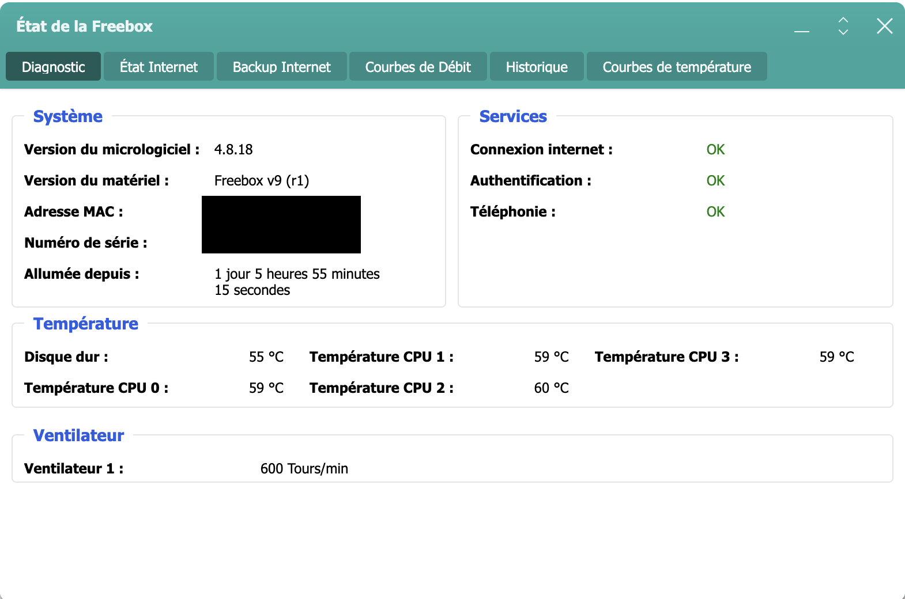

# Plugin Freebox_OS

## Troubleshotting

- **Je n'ai pas le message d'autorisation qui apparait sur la Freebox**

  > Vérifier dans les réglages de l'OS de la Freebox que le paramètre **Permettre les nouvelles demandes d'associations** est coché _(Paramètres de la Freebox -> Gestion des accès -> Onglet paramètres)_
  >
  > 

- **Je n'ai pas le niveau de batterie sur le capteur de présence de la Freebox et/ou sur la télécommande**

  > ces infos ne sont pas remontées à la Freebox donc impossible de les avoir dans Jeedom.
  >
  > Elles ne sont donc pas disponibles sur la page santé (il est indiqué secteur ou N/A)

- **Je ne peux pas commander la sirène de l'alarme de la Freebox**

  > Il n'est pas possible de commander directement cette sirène
  > [Voir Bugtracker Freebox FS#30650](https://dev.Freebox.fr/bugs/task/30650)

- **J'ai le message "Version d’API inconnue"**

  > **Il est nécessaire d'avoir la Freebox en version 4.7 minimum pour que le plugin fonctionne**

  > - Une détection automatique de la version API de la Freebox est lancée une fois par semaine.
  > - Il est possible de le lancer directement depuis l'écran d'Appairage
  > - Il est actuellement obligatoire de faire le reset de la clef API à chaque mise à jour
  >
  > 

  >
  > 

- **J'ai le message "unknown host, use IP address or maFreebox.Freebox.fr" et le Demon NOK**

  - Suite à la mise à jour de la Freebox 4.2.3
  > Free a changé l'adresse de la Freebox **_maFreebox.free.fr_**, celle-ci ne fonctionne plus il faut remplacer par **_maFreebox.Freebox.fr_**
  >
  > Voir le paragraphe **Installation et Configuration**

- **J'ai le widget des appareils connectés qui n'est plus disponible**

  > Le widget a été renommé lors d'une mise à jour'
  >
  > Il faut faire une **recherche des équipements supplémentaires** pour avoir le nouveau widget

- **J'ai les messages suivants qui apparaissent "Missing device_name" ou "Votre Jeedom n'a pas de Nom, il est impossible de continuer" lors de l'appairage**

  > **Votre Jeedom n'a pas de Nom**
  >
  > Il est impératif que votre Jeedom soit nommé pour continuer l'appairage du plugin avec votre Freebox
  >
  > Se rendre dans Réglages -> Système -> Configuration -> onglet Général et mettre un nom
  >
  > Recommencer ensuite l'authentification en n'oubliant pas de faire un reset de la configuration
  >
  > 

  >
  > 

- **Erreur CronDaily avec des noms d'appareils avec des icônes**

  > - Il ne faut pas que les noms d'appareils comportent des icônes.

- **Les nouveaux "Appareils connectés" et "Appareils connectés Wifi Invité" n'apparaissent pas lors de l'actualisation de l'équipement**

  > - Les nouveaux équipements ne sont pas ajoutés lors de l'actualisation mais uniquement avec le Cron Journalier

- **Je n'ai pas de message dans les logs en mode debug**

  > - Pour la partie Tile vu que le rafraichissement se fait plusieurs fois par minute, pour éviter de remplir les logs. Aucun message n'apparait dans les logs
  >
  > Pour avoir des logs, sur un équipement il faut cliquer sur le bouton "Rafraichir" de l'équipement

- **J'ai le message METHODE OBSOLETE => MERCI DE REGARDER LA DOCUMENTATION**

  > Les commandes ont changé dans la partie network, il est donc nécessaire de changer la méthode pour utiliser les commandes ci-dessous. *Voir le paragraphe "Gestion réseau"*
  >
  > Les commandes suivantes seront supprimées lors de la prochaine mise à jour :
  >
  > - **"Ajout - Supprimer filtrage Mac"** pour l'équipement *WIFI*
  > - **"Ajouter supprimer IP Fixe"** pour les équipements *Appareils connectés* et *Appareils connectés Wifi Invité*
  > - **"Wake on LAN"** pour les équipements *Appareils connectés* et *Appareils connectés Wifi Invité*

- **A quoi corresponde les différents moteurs de tâches**

  > - **RefreshToken** : Permet de rafraichir l'accès à la Freebox
  >
  > - **FreeboxPUT** : Permet de faire les actions sur la Freebox
  >
  > - **FreeboxAPI** :
    > Permet de tester de vérifier la dernière version de l'API de la Freebox
    > un contrôle est fait une fois par semaine
  >
  > - **FreeboxGET** : Permet de récupérer les données de type info de la partie domotique

- **L'état du Player ne remonte pas**

  > Il faut vérifier que le type pour la commande "Etat" est le sous type **Autre**
  > 

  
- **Le statut du Player n'est pas disponible**

  > Il faut absolument lancer un scan des équipements standards avec le Player sous tension

- **Les commandes "Appareil connecté choisi" et "Sélection appareil connecté"" dans l'équipement Gestion réseau**

  > Ces commandes seront créées automatiquement par l'équipement *Appareils connectés* et/ou *Appareils connectés Wifi Invité*

- **Impossible de démarrer le Demon**

  > Le démon sera autorisé a démaré uniquement si l'authentification et les droits sont OK. Cela se fait depuis le menu "appairage"

- **Le changelog indique : Attention : Il est nécessaire d’avoir la Freebox serveur en version x.x.x pour que le plugin fonctionne.**

 > Le plugin pour fonctionner nécessite d'avoir un firmware minimum.
 > 

 
 > Le firmware minimum est indiqué sur le changelog au début et au début de cette documentation
