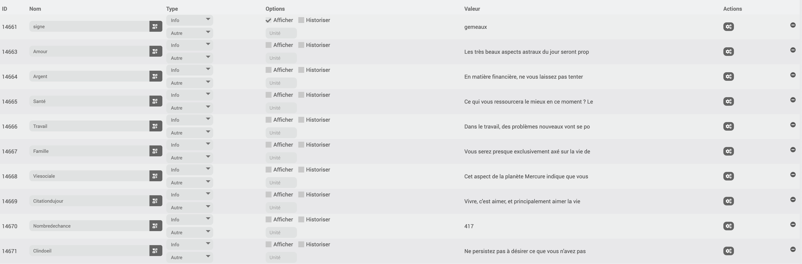
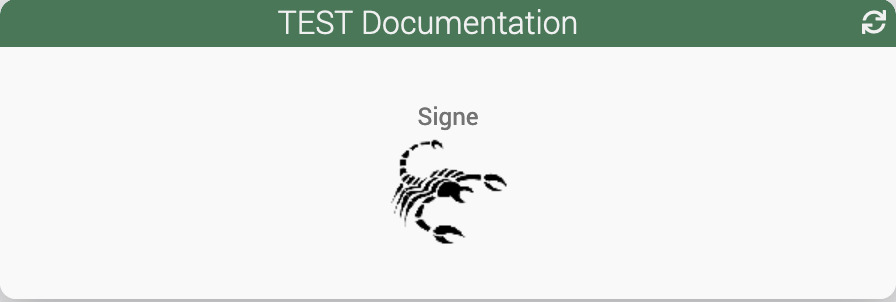

# Plugin Horoscope

# Description

Ce plugin permet de récupérer son horoscope tous les jours de façon automatique ou manuelle.

Plusieurs phrases sont disponibles chaque jours en fonction de thèmes comme Amour, Argent, Famille, Santé, ...
Une phrase symbolique est également disponible.

Ceci peut être très pratique afin de donner l'horoscope du jour à une personne (via une caméra Netatmo par exemple) ou par TTS tous les jours.

# Configuration

Le plugin ne comporte pas de configuration particulière.

> Il est possible de configurer un cron pour activer le relever automatique.

> Le plugin configure l'Auto-actualisation à 5h du matin tous les jours par défaut pour les nouveaux équipements.

Un widget est appliqué automatiquement sur la commande **Signe du zodiaque**

> 

> Exemples de commandes disponibles

> 

