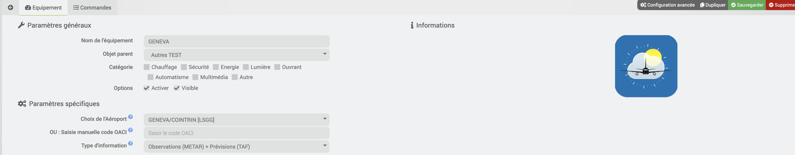
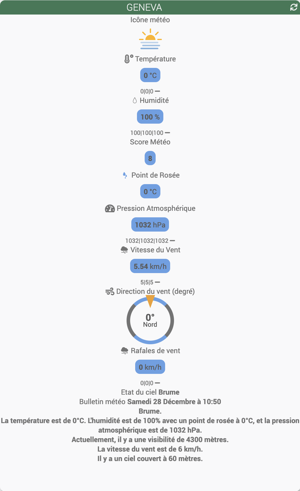

# Plugin „Metar Infos“

## Wichtig

> Diese Dokumentation wird vorübergehend hier gehostet, bis die offizielle Website wieder in Betrieb genommen wird.

Konfigurationsbeispiel

## Übersicht über die Geräteliste

## Konfigurationsbeispiel

