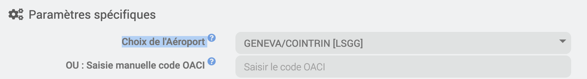

# Plugin Metar Infos

## Importante

> Esta documentación se encuentra alojada de forma provisional a la espera de que vuelva a estar operativo el sitio web oficial.

## Descripción

Complemento que permite recibir los informes meteorológicos de los aeropuertos (METAR), así como las previsiones (TAF)

Un METAR (oficialmente, «METeorological Aerodrome Report»¹, aunque a veces se define como «METeorological Airport Report»²) es un informe de observación (y no de predicción) meteorológica para la aviación.
Este complemento te permite recuperar y descodificar la información METAR de un aeropuerto. En su versión actual, se dispone de los siguientes datos (aunque estos dependen directamente de la información que transmita el aeropuerto seleccionado):

> - Estado del cielo
> - Boletín meteorológico detallado
> - Metar Data
> - Metar Válido
> - Hora UTC del telegrama
> - Hora local del telegrama
> - Velocidad del viento
> - Dirección del viento
> - Dirección del viento (rumbo)
> - Visibilidad
> - Temperatura
> - Punto de rocío
> - Humedad
> - Presión atmosférica
> - Nubes de nivel 1 a 3
> - Altitud de las nubes: niveles 1 a 3

## Configuración

El complemento no requiere ninguna configuración específica.

> En la configuración, hay que seleccionar el aeropuerto o introducir manualmente el código OACI

> Tipo de información: elegir el tipo de datos, ya sea METAR o METAR y TAF

