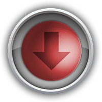
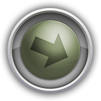
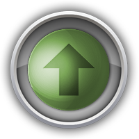

# Plugin „Tendance Baro“

## Beschreibung

Dieses Plugin ermöglicht es, die zu erwartende Wetterentwicklung auf der Grundlage der Luftdruckveränderungen der letzten Stunden zu berechnen.

## Konfiguration

Das Plugin verfügt über keine allgemeinen Einstellungen.
Es muss ein Gerät zur Messung des Luftdrucks hinzugefügt werden.

> Für dieses Gerät muss die Protokollierung aktiviert sein

## Wettertrend

> Quellen:
>
> - <a href="http://www.freescale.com/files/sensors/doc/app_note/AN3914.pdf">http://www.freescale.com/files/sensors/doc/app_note/AN3914.pdf</a>
> - <a href="https://www.parallax.com/sites/default/files/downloads/29124-Altimeter-Application-Note-501.pdf">https://www.parallax.com/sites/default/files/downloads/29124-Altimeter-Application-Note-501.pdf</a>

Das Plugin berechnet 6 Informationsstufen

|  Pegel  | Tendenz | Widget-Bild |
| :------: | :--------------------------------- | :----------------------------------------------------------------: |
| <b>0</b> | Starke Verschlechterung, unbeständig |  |
| <b>1</b> | Verschlechterung, anhaltend schlechtes Wetter |  |
| <b>2</b> | Langsame Verschlechterung, stabiles Wetter    |  |
| <b>3</b> | Langsame Verbesserung, stabiles Wetter   |  |
| <b>4</b> | Verbesserung, anhaltend gutes Wetter   |  |
| <b>5</b> | Starker Aufschwung, instabil |  |

## Das Plugin stellt zwei Widgets für den Trend zur Verfügung:

> - Baro/Trend (40x40-Symbol) (Standard-Widget)

> - Baro/Tendance 80x80 (Icon 80x80)

